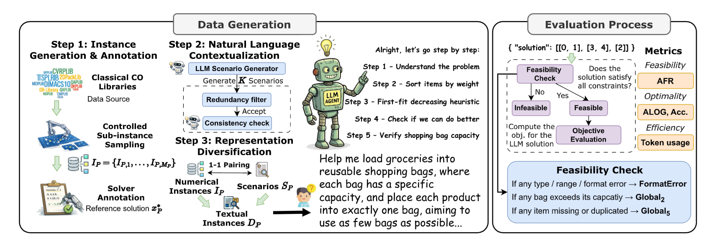
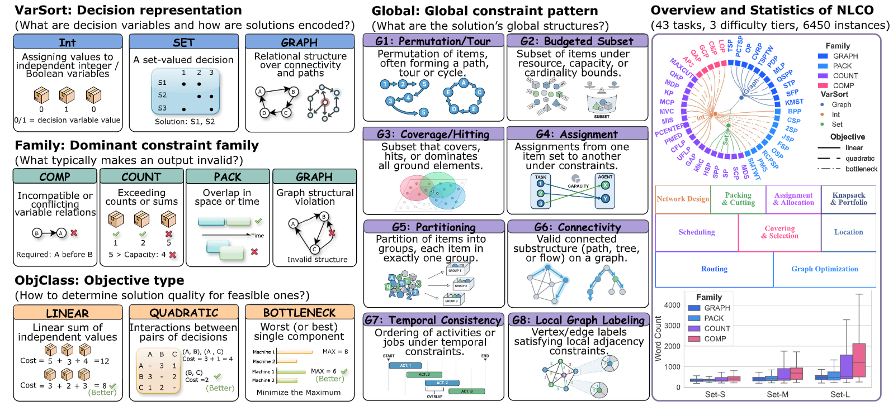
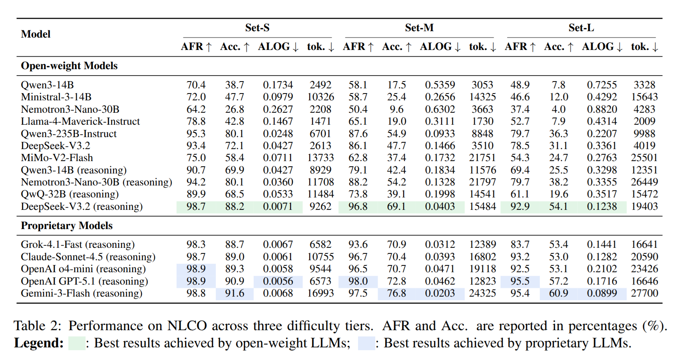
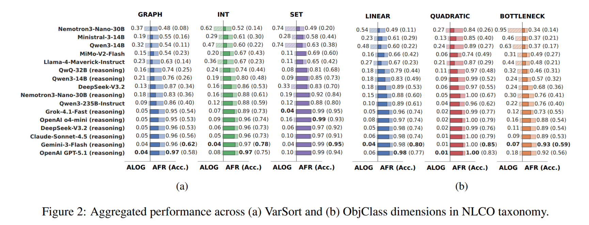

<div align="center">

# (ACL 2026 Findings) Reasoning in a Combinatorial and Constrained World: Benchmarking LLMs on Natural-Language Combinatorial Optimization

<p>
  <a href="https://arxiv.org/pdf/2602.02188"></a>
  <a href="https://huggingface.co/datasets/summer142857jiang/NLCO"></a>
  <a href="https://jing12e.github.io/nlco_eval/"></a>
</p>

<p>
  
  
  
  
</p>

<p>
  NLCO evaluates whether language models can solve combinatorial optimization problems directly from
  natural-language descriptions, without writing code and without calling external solvers.
</p>

</div>

---

## TL;DR

NLCO is a benchmark for end-to-end reasoning over constrained, discrete decision problems. A model reads a natural-language instance, infers the underlying optimization structure, and returns a structured solution that is scored for feasibility, objective quality, and efficiency.

| If you want to... | Start here |
| --- | --- |
| evaluate a model on released benchmark files | [Quick Start](#quick-start) and [Evaluation](#evaluation) |
| regenerate one task from configs | [Data Modes](#data-modes) and [Quick Start](#quick-start) |
| inspect the pipeline interactively | [UI](#ui) |
| extend the benchmark with a new task | [ADDING_NEW_PROBLEMS.md](ADDING_NEW_PROBLEMS.md) |

## Why NLCO

- Direct reasoning benchmark: the model must solve the optimization problem itself rather than generate code for an external solver.
- Structured evaluation: every response is checked for hard-constraint feasibility and objective quality.
- Broad coverage: routing, scheduling, packing, graph, facility-location, assignment, and set-style tasks are all represented.
- Multiple surface forms: the same underlying instance can be presented as natural language, JSON, CSV, or Markdown tables.

<p align="center">
  
</p>

## Benchmark At a Glance

| Property | Value |
| --- | --- |
| Tasks | 43 combinatorial optimization problems |
| Difficulty tiers | `S`, `M`, `L` |
| Input surface forms | `NL`, `JSON`, `CSV`, `Markdown Table` |
| Evaluation dimensions | Feasibility, optimality / quality, efficiency |
| Pipeline stages | Step 1 instance creation, Step 2 contextualization, Step 3 evaluation |
| Interface options | CLI and Streamlit UI |

## Task Coverage

| Family | Representative tasks |
| --- | --- |
| Routing | `TSP`, `CVRP`, `PDP`, `TSPTW`, `MLP`, `PCTSP`, `OP` |
| Scheduling | `JSP`, `FSP`, `OSP`, `PMS`, `RCPSP`, `SMTWT` |
| Packing | `BPP`, `KP`, `CSP`, `2SP`, `QKP` |
| Graph | `MIS`, `MVC`, `MCP`, `MAXCUT`, `GCP`, `MDS` |
| Tree / network design | `STP`, `KMST`, `SFP`, `QSPP` |
| Facility / location | `UFLP`, `CFLP`, `PMED`, `PCENTER`, `MDP` |
| Assignment | `AP3`, `GAP`, `QAP` |
| Set / covering | `SCP`, `SP`, `SPP`, `HSP`, `MkC` |
| Ordering / other discrete tasks | `LOP`, `CMP` |

<details>
<summary>Full task list (43)</summary>

`2SP`, `AP3`, `BPP`, `CFLP`, `CMP`, `CSP`, `CVRP`, `FSP`, `GAP`, `GCP`, `HSP`, `JSP`, `KMST`, `KP`, `LOP`, `MAXCUT`, `MCP`, `MDP`, `MDS`, `MIS`, `MLP`, `MVC`, `MkC`, `OP`, `OSP`, `PCENTER`, `PCTSP`, `PDP`, `PMED`, `PMS`, `QAP`, `QKP`, `QSPP`, `RCPSP`, `SCP`, `SFP`, `SMTWT`, `SP`, `SPP`, `STP`, `TSP`, `TSPTW`, `UFLP`

</details>

## What This Repository Contains

| Path | Purpose |
| --- | --- |
| `pipeline/` | orchestration entry points for running Step 1 and Step 2 from YAML configs |
| `problems/` | per-problem config files plus registry / adapter glue |
| `datasets/` | raw benchmark assets and cached contextualization resources |
| `step1_instance_creation/` | instance generation, solving, and reference-label creation |
| `step2_contextualization/` | natural-language contextualization and dataset writing |
| `step3_evaluation/` | model querying, parsing, scoring, and output aggregation |
| `ui/` | Streamlit app for interactive runs |
| `assets/` | figures used by this README |

## Benchmark Design

NLCO is organized with a four-layer taxonomy so results can be analyzed by structure rather than only by task name.

<p align="center">
  
</p>

- Variable sort: `INT`, `SET`, `GRAPH`
- Constraint family: comparison, counting, packing, graph-related, and other structural constraint types
- Global pattern: reusable global-constraint patterns
- Objective class: linear, quadratic, bottleneck, and related optimization forms

This makes it possible to study where models fail: not just on a named task, but on recurring structural patterns across tasks.

## Installation

Recommended Python version: `3.10` to `3.12`.

```bash
python -m venv .venv

# Windows PowerShell
.venv\Scripts\Activate.ps1

# macOS / Linux
source .venv/bin/activate

pip install -r requirements.txt
```

Notes:

- Many Step 1 generators use `gurobipy`; running them requires a valid Gurobi license at runtime.
- Some Step 1 tasks also expect raw benchmark assets that are not fully stored in GitHub and must be placed under `datasets/`.
- Step 3 evaluation is online by default and requires provider credentials in `step3_evaluation/configs/keys.json`.

### API Key Setup

Step 2 and Step 3 use different key-loading paths:

- Step 2 contextualization uses OpenAI and first checks `OPENAI_API_KEY`. If that is not set, it falls back to the `openai` field in `step3_evaluation/configs/keys.json`.
- Step 3 evaluation reads provider credentials from `step3_evaluation/configs/keys.json`.

Recommended setup:

```bash
cp step3_evaluation/configs/keys_template.json step3_evaluation/configs/keys.json
```

Then edit `step3_evaluation/configs/keys.json` and fill only the providers you plan to use.

If you prefer environment variables for Step 2, set:

```bash
export OPENAI_API_KEY=your_openai_key
```

On Windows PowerShell:

```powershell
$env:OPENAI_API_KEY = "your_openai_key"
```

### Gurobi Usage

`gurobipy` is only needed for Step 1 tasks that rely on Gurobi-based solvers. After installing the Python dependencies, activate a valid Gurobi license on your machine so that `gurobipy` can find `gurobi.lic` automatically.

Default license locations:

```text
Windows: C:\Users\<YOUR_USERNAME>\gurobi.lic
Linux:   /home/<YOUR_USERNAME>/gurobi.lic
macOS:   /Library/gurobi/gurobi.lic
```

Quick check:

```bash
python -c "import gurobipy as gp; m = gp.Model(); print('Gurobi is ready')"
```

If the command succeeds, your Gurobi setup is ready for Step 1 pipelines that use exact solvers.

## Data Modes

There are three common ways to use this repo:

| Mode | What you need | Typical use |
| --- | --- | --- |
| Evaluate released benchmark files | the contextualized CSVs already under `step2_contextualization/dataset/` | score models without rebuilding Step 1 / Step 2 |
| Rebuild Step 2 with cached contexts | Step 1 JSONs plus `datasets/cached_context/` | regenerate prompt datasets without fresh LLM calls |
| Rebuild from raw source assets | raw datasets under `datasets/` plus optional solver dependencies | rerun benchmark construction end to end |

Raw benchmark assets should be placed under:

```text
datasets/
```

Download link for the raw data bundle:

- Google Drive: `https://drive.google.com/drive/folders/1StvxsrlWw4BVE1YaJW7wWHF7sNdZYpGg?usp=sharing`

After downloading, extract the archive and keep the directory structure unchanged under `datasets/`.

## Quick Start

### 1. Rebuild one problem from config

Each problem has configs under:

```text
problems/<PROBLEM>/config/{S,M,L}.yaml
```

Example:

```bash
python -m pipeline.run --problem TSP --scale S
```

This reads `problems/TSP/config/S.yaml` and runs:

1. Step 1 instance creation
2. Step 2 contextualization

Outputs are written to the paths declared inside that YAML config. For tasks backed by external benchmark libraries, make sure the required raw files already exist under `datasets/`.

### 2. Evaluate a model on released contextualized CSVs

First, create `step3_evaluation/configs/keys.json` from `step3_evaluation/configs/keys_template.json` and fill in the provider keys you need.

Example with OpenAI:

```bash
python -m step3_evaluation.eval_cli \
  --problem TSP \
  --sizes S \
  --dataset_root step2_contextualization/dataset \
  --output_root eval_outputs \
  --model o4-mini \
  --provider openai \
  --reasoning enabled \
  --reasoning_effort high \
  --num_test 5
```

Example with Anthropic:

```bash
python -m step3_evaluation.eval_cli \
  --problem TSP \
  --sizes S \
  --dataset_root step2_contextualization/dataset \
  --output_root eval_outputs \
  --model claude-sonnet-4-5 \
  --provider anthropic \
  --reasoning enabled \
  --anthropic_budget 40000 \
  --num_test 5
```

### 3. Reuse cached contexts in Step 2

Many configs already enable:

- `step2.load_cached_contexts: true`
- `step2.contexts_audit_path: datasets/cached_context/<PROBLEM>/<PROBLEM>_contexts.json`

When those cached files are present, Step 2 can rebuild contextualized datasets without generating new scenarios through an LLM.

### 4. Run the UI

```bash
streamlit run ui/app.py
```

## Evaluation

Evaluation consumes the CSV files produced by Step 2 and writes per-size plus overall summaries.

Default input root:

```text
step2_contextualization/dataset
```

Default output root:

```text
eval_outputs
```

Per-size output files:

```text
<output_root>/<PROBLEM>/<MODEL>/<PROBLEM>_<SIZE>_eval.csv
```

Overall summary files:

```text
<output_root>/<PROBLEM>/<MODEL>/<PROBLEM>_<MODEL>_overall.csv
```

Supported providers in the current CLI:

- `openai`
- `anthropic`
- `deepseek`
- `gemini`
- `vertex_maas`
- `openrouter`
- `xiaomi`

## Output Cheat Sheet

| Stage | Default output location |
| --- | --- |
| Step 1 instances | `step1_instance_creation/generated_data/<PROBLEM>/` |
| Step 2 contextualized datasets | `step2_contextualization/dataset/<PROBLEM>/` |
| Step 2 cached context audits | `datasets/cached_context/<PROBLEM>/` |
| Step 3 evaluation results | `eval_outputs/<PROBLEM>/<MODEL>/` |
| Evaluation provider keys | `step3_evaluation/configs/keys.json` |

Typical Step 2 files:

```text
<PROBLEM>_<SIZE>_context.json
<PROBLEM>_<SIZE>_context.csv
```

Normalized Step 2 records align with the Hugging Face release and include fields such as:

- `id`
- `task_id`
- `difficulty_tier`
- `prompt`
- `surface_format`
- `instance_canonical_json`
- `reference_solution_canonical_json`
- `reference_objective_value`

## Main Results

The paper reports three broad findings:

1. Strong frontier models can achieve high feasibility and good objective quality on small instances.
2. Performance drops noticeably as difficulty increases from `S` to `L`.
3. Reliability depends strongly on problem structure; graph-oriented and bottleneck-style tasks remain harder than set-based ones.

### Difficulty-tier performance

<p align="center">
  
</p>

### Taxonomy-level performance

<p align="center">
  
</p>

## Directory Guides

- [pipeline/README.md](pipeline/README.md)
- [problems/README.md](problems/README.md)
- [datasets/README.md](datasets/README.md)
- [step1_instance_creation/README.md](step1_instance_creation/README.md)
- [step2_contextualization/README.md](step2_contextualization/README.md)
- [step3_evaluation/README.md](step3_evaluation/README.md)
- [ui/README.md](ui/README.md)
- [ADDING_NEW_PROBLEMS.md](ADDING_NEW_PROBLEMS.md)
- [EVAL.md](EVAL.md)

## UI

The Streamlit app can:

- edit pipeline configs,
- run generation and contextualization jobs,
- inspect produced data,
- and trigger evaluation jobs from the browser.

Launch it with:

```bash
streamlit run ui/app.py
```

## Reference

This is the official repository for:

- Xia Jiang, Jing Chen, Cong Zhang, Jie Gao, Chengpeng Hu, Chenhao Zhang, Yaoxin Wu, Yingqian Zhang.
  *Reasoning in a Combinatorial and Constrained World: Benchmarking LLMs on Natural-Language Combinatorial Optimization.*
  arXiv:2602.02188, 2026.

Paper link:

- https://arxiv.org/pdf/2602.02188

## Citation

If you use NLCO in your research, please cite:

```bibtex
@article{jiang2026reasoning,
  title={Reasoning in a Combinatorial and Constrained World: Benchmarking LLMs on Natural-Language Combinatorial Optimization},
  author={Jiang, Xia and Chen, Jing and Zhang, Cong and Gao, Jie and Hu, Chengpeng and Zhang, Chenhao and Wu, Yaoxin and Zhang, Yingqian},
  journal={arXiv preprint arXiv:2602.02188},
  year={2026}
}
```
